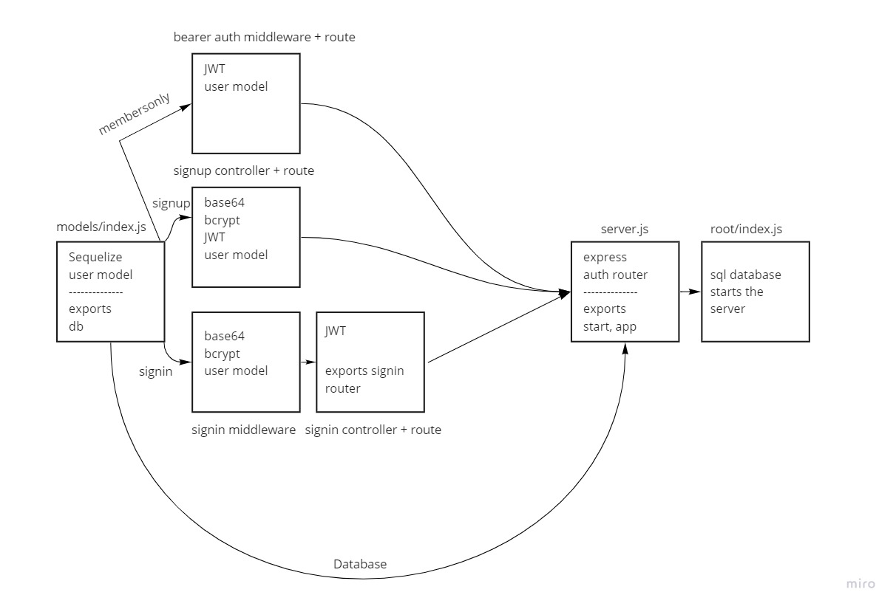

# bearer-auth

A server that allows a user to create an account as well as to handle Basic Authentication (user provides a username + password). When a “good” login happens, the user is considered to be “authenticated” and our auth-server generates a JWT signed “Token” which is returned to the application

## UML Diagram

## Submission

1. [PR Link](https://github.com/karamalqinneh/bearer-auth/pull/2)
2. [Deployed Server](https://karam-bearer-auth.herokuapp.com/)
